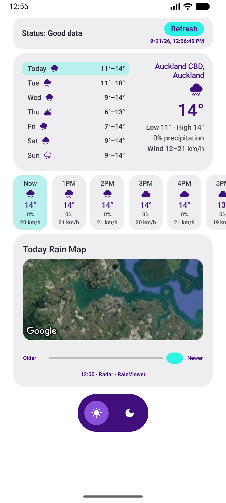
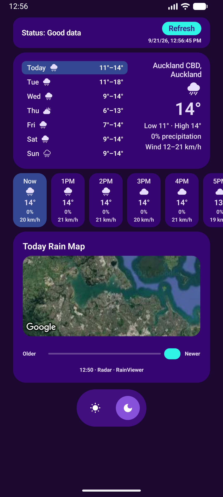

# Spark Satellite Weather (Android)

Spark Satellite Weather is a **weather demo app**: it shows current conditions, a 7‑day forecast with hourly breakdown, and a rain radar map for your location. The app’s main purpose is to demonstrate **satellite (connection-aware) behaviour**. When the device is on **satellite** connectivity (API 31+), the app shows **"Status: Low data"** and the rain map is hidden; Wi‑Fi, Ethernet, and cellular (4G/5G) are treated as **Good** in the status bar—for example the rain map is only loaded when status is Good data. All weather and radar data use the **device location**; there is no fallback if location is unavailable.

## Table of contents

- [Screenshots](#screenshots)
- [How to use the app](#how-to-use-the-app)
- [Satellite connectivity in development and testing](#satellite-connectivity-in-development-and-testing)
- [Requirements](#requirements)
- [Installation](#installation)
- [Troubleshooting](#troubleshooting)
- [Documentation](#documentation)
- [Project structure (connectivity and location)](#project-structure-connectivity-and-location)
- [License](#license)

## Screenshots

**Light and dark themes** — Spark appearance.

  
  &nbsp;
  

## How to use the app

1. Run the app on an emulator or device (**Run** ▶).
2. Grant **location** permission when prompted.
3. The app loads weather for the current location. Use **Refresh** to update after changing the device location.
4. Select a day in the list to see that day’s details and the hourly strip.
5. When connection is **Good**, the **rain map** (radar overlay) is available; use the Older–Newer slider to scrub through radar frames. When connection is Low or None, the rain map section shows a placeholder.
6. Tap **sun** or **moon** in the bottom theme bar to switch between light and dark Spark themes.

## Satellite connectivity in development and testing

- **What you see:** The status bar shows **"Status: Good data"** / **"Status: Low data"** / **"Status: No data"**. Good = Wi‑Fi, Ethernet, or cellular (4G/5G); Low = satellite transport only; None = no network.
- **How to see Low/Good:** On a device, Wi‑Fi or mobile data (4G/5G) → Good; only satellite-capable links show Low (**API 31+**). To **force a status for testing**, launch with:  
  `adb shell am start -n com.akqa.sparksatelliteweather/.MainActivity --es connectivity_override good`  
  (use `good`, `low`, or `none`). For **real satellite** (not the override), use hardware and a plan that expose **`TRANSPORT_SATELLITE`**.
- **How behaviour changes:** When **Good**, the rain map is loaded; when **Low** or **None**, a placeholder is shown. See [docs/SATELLITE.md](docs/SATELLITE.md) for implementation details.

## Requirements

- **Android Studio** — **Quail 4 (2026.1.4)+** recommended for AGP **9.4** / `compileSdk` **37**. Older Studio versions may refuse to sync; use the [`v1.0.0`](https://github.com/AKQAAPAC/spark-satellite-app-android/releases/tag/v1.0.0) release for the previous toolchain.
- **minSdk 26**, **targetSdk 36**, **compileSdk 37**.
- **Location permission** — For weather and rain map.
- **Google Maps API key** (rain map only): Create a key in [Google Cloud Console](https://console.cloud.google.com/) with **Maps SDK for Android** enabled. Add to the project root’s `local.properties`: `MAPS_API_KEY=your_api_key_here`. Copy `local.properties.example` to `local.properties` if needed.

## Installation

1. Clone the repository (or download the source).
2. Open the **project root** (the folder containing `settings.gradle.kts`) in Android Studio.
3. Sync the project with Gradle (**File → Sync Project with Gradle Files**).
4. Add `MAPS_API_KEY` to `local.properties` if you want the rain map (see [Requirements](#requirements)).

## Troubleshooting

- **"No location found" on a real device:** The app needs location permission and an available fix. Check: (1) **Settings → Apps → Spark Satellite Weather → Permissions** — ensure **Location** is allowed (e.g. "Allow only while using the app"). (2) **Settings → Location** — turn location on for the device. (3) Open the app and tap **Refresh**; if it was a cold start with no cached location, a second try often succeeds. On some devices (e.g. Samsung), **Settings → Battery** → ensure the app isn’t restricted from using location in the background if you see issues after leaving the app.

## Documentation

- **[docs/SATELLITE.md](docs/SATELLITE.md)** — Satellite / connection-aware behaviour, testing overrides, and **how to use the same pattern on older vs newer Android versions** (API 26 through 37+).

## Project structure (connectivity and location)

| Path | Purpose (satellite / connectivity / location) |
|------|-----------------------------------------------|
| `Connectivity.kt` | Connectivity enum (Good/Low/None) and `connectivityFlow()`; `description` returns "Status: Good/Low/No data". See [docs/SATELLITE.md](docs/SATELLITE.md). |
| `LocationHelper.kt` | Fused Location Provider and reverse geocoding; `getCurrentLocation(forceRefresh)` for initial load vs user Refresh. |
| `WeatherViewModel.kt` | Subscribes to `connectivityFlow()`, keeps `state.connectivity`; loads weather and radar from location; only loads rain map when `Connectivity.Good`. |
| `ui/ContentView.kt` | Status bar, forecast, rain map, and Spark theme toggle; rain map only when Good. |
| `ui/theme/` | Spark Generative Commerce tokens (colors, spacing, radius, typography) and light/dark appearance. |

Other modules (e.g. `data/`, `di/`) handle weather API and UI; see the source and [docs/SATELLITE.md](docs/SATELLITE.md) for the full flow.

## License

This project is licensed under the Apache License 2.0 — see [LICENSE](LICENSE) for details.
